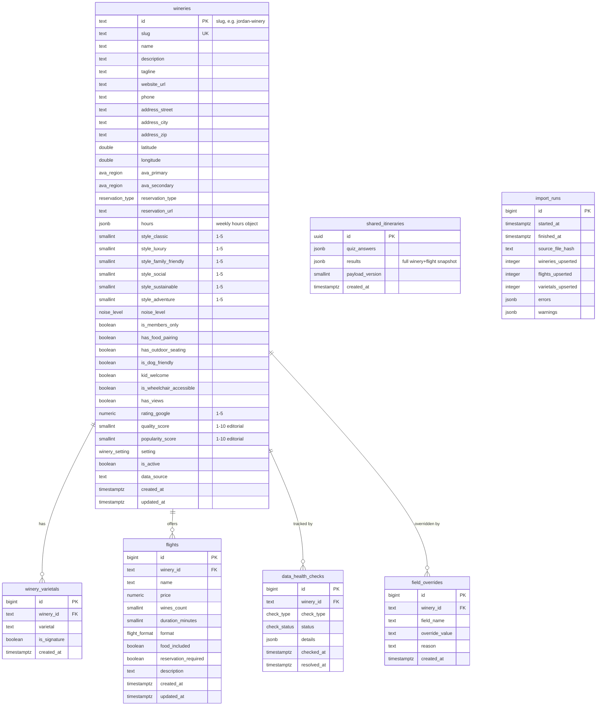

# Entity-Relationship Diagram

## Enums

| Enum               | Values                                                                                                                                                                     |
| ------------------ | -------------------------------------------------------------------------------------------------------------------------------------------------------------------------- |
| `reservation_type` | `walk_ins_welcome`, `reservations_recommended`, `appointment_only`                                                                                                         |
| `noise_level`      | `quiet`, `moderate`, `lively`                                                                                                                                              |
| `flight_format`    | `seated`, `standing`, `tour`, `outdoor`, `picnic`, `bar`                                                                                                                   |
| `ava_region`       | `russian_river_valley`, `dry_creek_valley`, `alexander_valley`, `sonoma_valley`, `carneros`, `sonoma_coast`, `sonoma_mountain`, `green_valley`, `petaluma_gap`, `rockpile` |
| `winery_setting`   | `vineyard`, `estate`, `downtown`, `hilltop`, `cave`                                                                                                                        |
| `check_type`       | `url_health`, `hours_drift`, `rating_drift`, `missing_data`, `user_report`                                                                                                 |
| `check_status`     | `open`, `resolved`, `ignored`                                                                                                                                              |

## RLS Policies

| Table                | `anon`/`authenticated` | `service_role`                      |
| -------------------- | ---------------------- | ----------------------------------- |
| `wineries`           | SELECT                 | Full (bypasses RLS)                 |
| `winery_varietals`   | SELECT                 | Full                                |
| `flights`            | SELECT                 | Full                                |
| `shared_itineraries` | SELECT                 | Full (INSERT via service role only) |
| `import_runs`        | None                   | Full                                |
| `data_health_checks` | None                   | Full                                |
| `field_overrides`    | None                   | Full                                |
